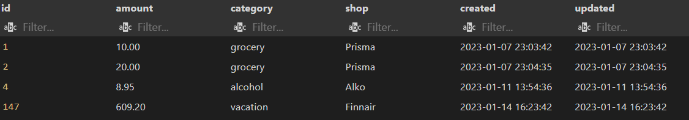

## For TAMK course 4A00EZ62 Backend Development - Final Project

## Topic

Most of us want to know where our money goes. An application for tracking your personal expenses.
You can add amount, category and shop on database table money_manager with.....

SCREENSHOT HERE



## General Project to see on render server

Backend server address and implemented endpoints ..

https://expenses-node-express-api.onrender.com/api/expenses

#### Screenshot from render


## Frontend server address (not done yet)

Upcoming...

## Instructions for running the application locally

#### Node instructions

##### Install npm packages
`npm install`

##### Start the backend port
`npm run start`

##### See outcome on**
http://localhost:5000/api/expenses

##### Test enpoints**
`npm run test`

Endpoints routes tested:
GET
POST
PUT
DELETE

Validation:
POST - √ should not allow negative amounts
       √ should not allow zero amounts
       √ should not allow string as amount
PUT - upcoming ..
        should allow only string as category or shop


##### to POST new expense**

 ##### to UPDATE new expense**


### SQL statements for creating and adding default data
```
-- Create Table
CREATE TABLE IF NOT EXISTS money_manager (
  id int(11) NOT NULL AUTO_INCREMENT,
  amount decimal(11,2) NOT NULL,
  category varchar(100),
  shop varchar(100),
  created timestamp NOT NULL DEFAULT CURRENT_TIMESTAMP,
  updated timestamp NOT NULL DEFAULT CURRENT_TIMESTAMP ON UPDATE CURRENT_TIMESTAMP,
  PRIMARY KEY (`id`)
);
-- Insert values to table, id, created and updated columns will be autocreated
INSERT INTO money_manager ( amount, category, shop)
VALUES (
    '8.95',
    'alcohol',
    'Alko'
  );
INSERT INTO money_manager ( amount, category, shop)
VALUES (
    '10.00',
    'crocery',
    'Prisma'
  );
INSERT INTO money_manager ( amount, category, shop)
VALUES (
    '200.00',
    'vacation',
    'Finnair'
  );
INSERT INTO money_manager ( amount, category, shop)
VALUES (
    '100.20',
    'crocery',
    'Lidl'
  );

```

## Project self evaluation

use project evaluation criteria (see Evaluation section)
