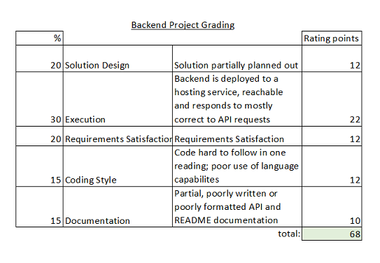

## For TAMK course 4A00EZ62 Backend Development - Final Project

## Topic

Most of us want to know where our money goes. An application for tracking your personal expenses.
You can add amount, category and shop on database table money_manager.

money_manager


## General Project is not finished.

Backend server address and implemented endpoints
+ GET all
+ GET one by id
+ POST
+ PUT
+ DELETE one by id

https://expenses-node-express-api.onrender.com/api/expenses

#### Screenshot from render


### Frontend server address (not done yet)

Upcoming... better view...
https://expenses-node-express-api.onrender.com/api/expenses

+ GET button - GET all expenses
+ POST button - POST amount
+ DELETE button - Not working at the moment!

## Instructions for running the application locally

#### Node instructions

##### -> Install npm packages
`npm install`

##### -> Start the backend port
`npm run start`

##### -> endpoints manipulation on file
localhost.rest

##### -> See outcome on
http://localhost:5000/api/expenses

##### -> intergration tests to enpoints**
`npm run test`

Endpoints routes tested and working:
+ GET
+ POST
+ PUT
+ DELETE

Validation:
1. POST  -
- [√] should not allow negative amounts
- [√] should not allow zero amounts
- [√] should not allow string as amount
2. PUT - upcoming ..
- [ ] should allow only string as category or shop


## SQL statements for creating and adding default data
```
-- Create Table
CREATE TABLE IF NOT EXISTS money_manager (
  id int(11) NOT NULL AUTO_INCREMENT,
  amount decimal(11,2) NOT NULL,
  category varchar(100),
  shop varchar(100),
  created timestamp NOT NULL DEFAULT CURRENT_TIMESTAMP,
  updated timestamp NOT NULL DEFAULT CURRENT_TIMESTAMP ON UPDATE CURRENT_TIMESTAMP,
  PRIMARY KEY (`id`)
);
-- Insert values to table, id, created and updated columns will be autocreated
INSERT INTO money_manager ( amount, category, shop)
VALUES (
    '8.95',
    'alcohol',
    'Alko'
  );
INSERT INTO money_manager ( amount, category, shop)
VALUES (
    '10.00',
    'crocery',
    'Prisma'
  );
INSERT INTO money_manager ( amount, category, shop)
VALUES (
    '200.00',
    'vacation',
    'Finnair'
  );
INSERT INTO money_manager ( amount, category, shop)
VALUES (
    '100.20',
    'crocery',
    'Lidl'
  );

```
## OpenAPI/Swagger documentation for API.


## Project self evaluation

Self evaluation = 2



## Licence

MIT © Maria Turunen
